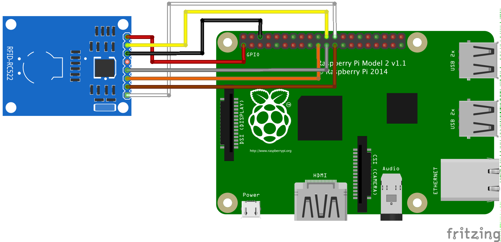

# Raspberry PI + RFID = Jukebox

Play music with RFID cards. Inspired by [this](https://github.com/hoveeman/music-cards) and [that](https://pimylifeup.com/raspberry-pi-rfid-rc522/).

### Hardware
Connect **Raspberry Pi** and **RC522 RFID Reader**.
  - **SDA** connects to **Pin 24**
  - **SCK** connects to **Pin 23**
  - **MOSI** connects to **Pin 19**
  - **MISO** connects to **Pin 21**
  - **GND** connects to **Pin 6**
  - **RST** connects to **Pin 22**
  - **3.3v** connects to **Pin 1**



### Software

Update system and then install all necessary software.
```
sudo apt-get update
sudo apt-get upgrade -y
sudo apt-get install -y omxplayer git supervisor python-pip
git clone https://github.com/argoroots/jukebox.git
pip install -r jukebox/requirements.txt
```

Copy supervisor configuration.
```
sudo cp jukebox/supervisor.conf /etc/supervisor/conf.d/
```
Enable the SPI Interface by running following command. From first screen select **5 Interfacing Options**, then **P4 SPI** and enable it.
```
sudo raspi-config
```

Check if it's enabled by running following command. It must list _spi_bcm2835_.
```
lsmod | grep spi
```

### Cards & music
Add card ids and corresponding folder or stream url to _cards.yaml_.
